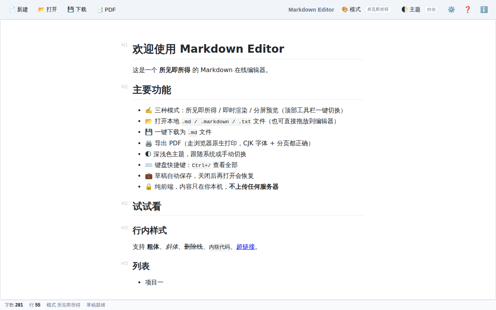
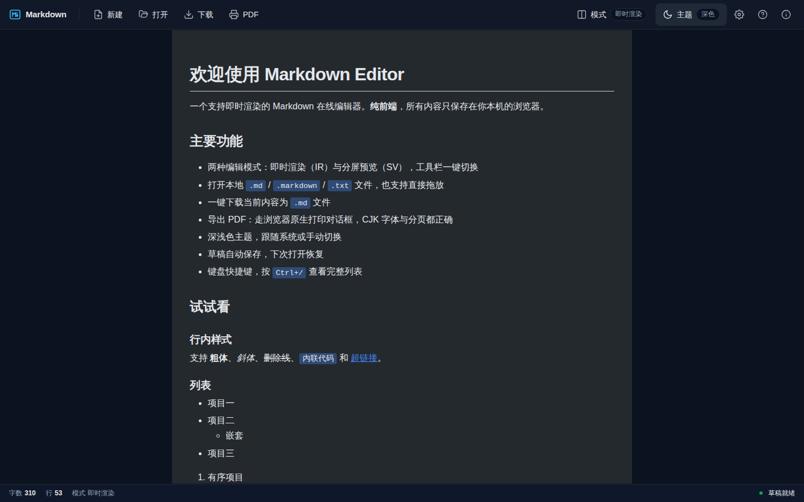

# Markdown Editor

[English](#english) · 中文（下方）

A Typora-like, browser-based WYSIWYG Markdown editor. Pure frontend, zero backend, deploys to nginx.

<p align="center">
  
  
</p>

---

## 中文

### 特性

- **所见即所得**：编辑器内即时呈现 Markdown 样式（Typora 风格），三种模式一键切换：WYSIWYG / 即时渲染 (IR) / 分屏 (SV)
- **本地文件 IO**：点击或拖放打开 `.md / .markdown / .txt`，一键下载为 `.md`
- **PDF 导出**：浏览器原生打印 + 专用 print stylesheet，CJK 字体与分页都正确，PDF 文本可搜索
- **草稿自动保存**：编辑变化 500ms 防抖写入 localStorage；关闭后再打开自动恢复
- **深浅色主题**：自动跟随系统或手动切换
- **键盘快捷键**：`Ctrl+/` 查看全部
- **纯前端**：所有数据只在你本机，**不向任何服务器上传内容**
- **生产姿态**：TypeScript strict / DOMPurify HTML 清洗 / CSP / 单测 + E2E / Docker + nginx 一键部署

### 快速开始

#### Docker（推荐）

```bash
docker compose up -d
# 打开 http://localhost:8080
```

#### 本地开发

```bash
pnpm install         # 或 npm install
pnpm run dev         # 打开 http://localhost:5173
```

#### 生产构建 + 预览

```bash
pnpm run build       # 产物在 dist/
pnpm run preview     # http://localhost:4173
```

#### 直接部署到 nginx

将 `dist/` 目录复制到 nginx 的 `root`，并参考 `nginx/default.conf` 配置 CSP / 缓存。详情见 [docs/DEPLOYMENT.md](docs/DEPLOYMENT.md)。

### 键盘快捷键

| 操作         | 快捷键                 |
| ------------ | ---------------------- |
| 新建（清空） | `Alt + N`              |
| 打开本地文件 | `Alt + O`              |
| 下载 `.md`   | `Ctrl/Cmd + Shift + S` |
| 导出 PDF     | `Ctrl/Cmd + Shift + E` |
| 切换编辑模式 | `Ctrl/Cmd + Shift + M` |
| 切换主题     | `Ctrl/Cmd + Shift + T` |
| 设置         | `Ctrl/Cmd + ,`         |
| 快捷键帮助   | `Ctrl/Cmd + /`         |

### 技术栈

- **TypeScript 5** (strict mode) + **Vite 5**
- **[Vditor 3](https://github.com/Vanessa219/vditor)** — Markdown 编辑器内核（MIT）
- **[DOMPurify](https://github.com/cure53/DOMPurify)** — HTML 清洗
- **Vitest** + **Playwright** — 单元 + E2E 测试
- **Docker** + **nginx** — 部署
- **GitHub Actions** — CI/CD

### 项目结构

```
markdown-editor/
├── src/             应用源码
│   ├── editor/      Vditor 封装 / 主题 / 模式
│   ├── io/          文件读写 / PDF 导出
│   ├── lib/         logger / storage / sanitize
│   ├── ui/          toolbar / 状态栏 / 弹窗 / 快捷键
│   └── styles/      CSS（主题 / print）
├── tests/
│   ├── unit/        Vitest 单测
│   └── e2e/         Playwright E2E
├── nginx/           生产 nginx 配置
├── scripts/         构建辅助脚本
└── docs/            架构 / 部署 / 开发文档
```

### 已知限制

1. **PDF 导出**：触发后弹出浏览器原生打印对话框，用户在对话框内选择「另存为 PDF」。此设计为获得正确的 CJK 字体与分页。
2. **远程图片**：CSP 默认 `img-src 'self' data: blob:`，会拦截外链图片。Markdown 中粘贴远程图片 URL 时，编辑器预览与 PDF 导出都会显示空白。建议用 base64 内联或本地图片，或在 nginx 配置中放宽 CSP（参考 [docs/DEPLOYMENT.md](docs/DEPLOYMENT.md)）。
3. **Vditor 模式切换**：从 WYSIWYG → IR/SV 时，cursor 位置不保证恢复（内容会保留）。

### 贡献

欢迎 issue / PR。请先阅读 [CONTRIBUTING.md](CONTRIBUTING.md)。

### License

MIT。详见 [LICENSE](LICENSE)。

第三方依赖完整的版权与许可证文本见 [NOTICES.md](NOTICES.md)（由 `pnpm run notices` 自动生成）。

Credits：

- [Vditor](https://github.com/Vanessa219/vditor) by Vanessa219 / B3log 开源 (MIT)
- [DOMPurify](https://github.com/cure53/DOMPurify) by Cure53 (Apache-2.0 / MPL-2.0 双许可)

---

<a id="english"></a>

## English

### Features

- **WYSIWYG** Markdown rendering in-editor (Typora-style), with three switchable modes: WYSIWYG / Instant Render (IR) / Split View (SV)
- **Local file IO**: open `.md / .markdown / .txt` by click or drag-drop; download as `.md`
- **PDF export** via the browser's native print pipeline + dedicated print stylesheet — proper CJK fonts, page breaks, and searchable text
- **Auto-saved drafts** to `localStorage`; restored on next open
- **Light / Dark theme** that follows the system or can be toggled manually
- **Keyboard shortcuts**: `Ctrl + /` to view all
- **Zero backend**. All content stays on your machine.
- **Production posture**: TypeScript strict / DOMPurify / CSP / unit + E2E tests / Docker + nginx one-shot deploy

### Quickstart

```bash
docker compose up -d            # http://localhost:8080
# or
pnpm install && pnpm run dev    # http://localhost:5173
```

### Tech stack

TypeScript 5 + Vite 5 + Vditor 3 + DOMPurify + Vitest + Playwright + Docker + nginx.

### Known limitations

1. PDF export uses `window.print()` — users pick "Save as PDF" in the browser dialog. This choice gives correct CJK fonts, page breaks, and searchable text.
2. Remote images are blocked by the default CSP `img-src 'self' data: blob:`. Use base64-inlined or local images, or relax CSP in `nginx/default.conf`.
3. Switching Vditor modes may not preserve cursor position (content is preserved).

### License

MIT. See [LICENSE](LICENSE). Bundled third-party copyright notices in
[NOTICES.md](NOTICES.md) (auto-generated by `pnpm run notices`).
