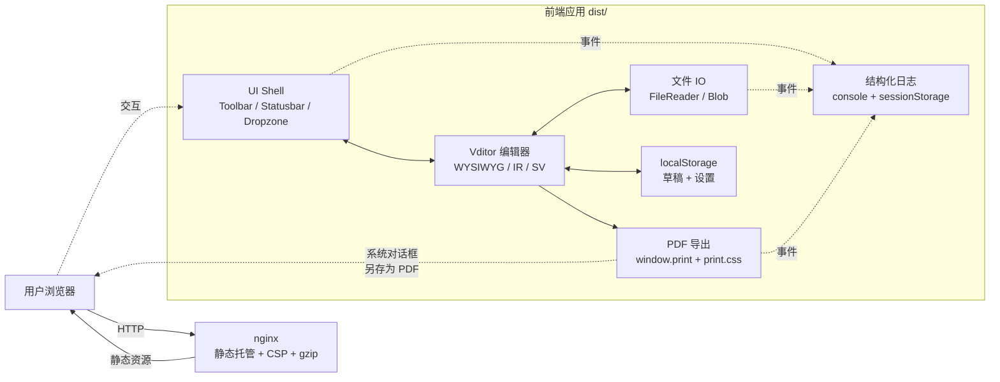

# Architecture

## 高层结构



## 模块边界

| 路径          | 职责                                                           |
| ------------- | -------------------------------------------------------------- |
| `src/main.ts` | 入口；挂载 `#app`，引导失败兜底文案                            |
| `src/app.ts`  | 应用装配；状态、回调、Vditor 生命周期                          |
| `src/editor/` | Vditor 包装、主题、模式枚举                                    |
| `src/io/`     | 纯粹的输入/输出：FileReader 读、Blob 写、`window.print` 导出   |
| `src/ui/`     | DOM 构建（无业务）：toolbar、状态栏、弹窗、快捷键、拖放、toast |
| `src/lib/`    | 横切关注点：logger、storage、文件名净化                        |
| `src/styles/` | CSS：主题变量、应用 shell、print stylesheet                    |

## 关键设计决策

### PDF 导出走 `window.print()`

**问题**：客户端 PDF 库（`html2pdf.js` 等）对 CJK 字体支持差、分页规则有限、html2pdf.js 维护已停滞。

**方案**：使用浏览器原生打印对话框 + 专用 `print.css`。

**实现**：

1. 取 `vditor.getHTML()` 渲染后的 HTML
2. DOMPurify 二次清洗
3. 注入到 `.print-container` 隐藏容器
4. 给 `body` 加 `.printing` 类
5. `window.print()` 触发系统对话框
6. 监听 `afterprint` 事件清理

**收益**：CJK 字体由浏览器原生回退、分页规则由 CSS `@page` 控制、PDF 文本可搜索、零依赖、零维护负担。

**代价**：UX 是「弹打印对话框」而非「直接下载 .pdf」，已写入 README 显式说明。

### Vditor 资源本地化

Vditor 默认从 `unpkg.com/vditor@<version>/dist/` 加载附加资源（语法高亮、语言包）。直接用 CDN 会破坏 `default-src 'self'` 的 CSP。

**方案**：构建时通过 `scripts/copy-vditor-assets.mjs` 把 `node_modules/vditor/dist/` 拷贝到 `public/vditor/dist/`，Vditor 初始化时设 `cdn: '/vditor'`。

### 草稿持久化

`localStorage` 键 `mdeditor:state`，schema 带版本号。`saveState` 防抖 500ms，写入失败（quota）会写 WARN 级日志并返回 false。`loadState` 在 schema 不匹配时丢弃旧数据并返回 null。

### CSP

```
default-src 'self';
script-src 'self' 'unsafe-inline' 'wasm-unsafe-eval';
worker-src 'self' blob:;
style-src 'self' 'unsafe-inline';
img-src 'self' data: blob:;
font-src 'self' data:;
connect-src 'self';
object-src 'none';
base-uri 'self';
frame-ancestors 'none';
```

- `script-src 'unsafe-inline'`：Vditor 在加载部分 lazy 插件时注入 inline `<script>`。XSS 防御仍依赖 DOMPurify 二次清洗 + 同源约束 + `default-src 'self'`。
- `wasm-unsafe-eval`：部分 Vditor 高亮库可能用 WASM
- `worker-src 'self' blob:`：Vditor 在某些场景使用 Worker
- `style-src 'unsafe-inline'`：Vditor 切换主题时注入 inline `<style>`
- `img-src 'self' data: blob:`：外链图片默认被拦截（见 README 已知限制）

## 数据流

1. 用户输入 → Vditor `input` 回调 → 更新字数 / 行数 → 防抖 500ms 后写 localStorage
2. 文件上传 → `FileReader.readAsText('utf-8')` → 校验类型与大小 → `vditor.setValue()`
3. 下载 → 从 H1 推导文件名 → `new Blob([md])` → 触发 `<a download>` 点击 → 1s 后 `revokeObjectURL`
4. PDF 导出 → `vditor.getHTML()` → DOMPurify → `print-container` → `body.printing` → `window.print()` → `afterprint` 清理

## 测试金字塔

- **单测**（Vitest + jsdom）：覆盖 `src/io/*`, `src/lib/*`, `src/editor/modes`, `src/editor/theme`。门槛 lines ≥ 80%。
- **E2E**（Playwright + Chromium）：3 个核心 smoke
  - 启动 + 工具栏 + 编辑器渲染 + 快捷键
  - 文件上传 + 下载往返
  - PDF 导出触发器与 `printing` 类生命周期
- UI 集成层不计入单测覆盖率门槛（E2E 已覆盖）。
